# Microwave Control API / API de Controle de Microondas
  
  

### Features / Funcionalidades
- JWT-based authentication
- Microwave program management 
- Custom heating profiles
- Modern .NET 8 backend
- Secure API endpoints

### Installation

1. **Clone the repository**:
```bash
git clone https://github.com/alissonthx/MicrowaveApp.git
cd MicrowaveApp
```
2. **Restore dependencies / Restaurar pacotes**:
```bash
dotnet restore
```
## ▶️ Run Applications / Executar Aplicações

Note: In case of using Visual Studio, open MicrowaveApp.sln on path MicrowaveApp\MicrowaveApp.UI / Em caso de estar utilizando Visual Studio, abra  MicrowaveApp.sln no diretório MicrowaveApp\MicrowaveApp.UI
Run in separate terminals / Executar em terminais separados:

```bash
# Terminal 1 - API
cd MicrowaveApp.WebApi
dotnet run

# Terminal 2 - UI/Interface
cd MicrowaveApp.UI
dotnet run
```

## 🔐 Authentication / Autenticação

### Token Expiration / Expiração do Token
**2 hours** / **2 horas**

### Default Credentials / Credenciais Padrão
```text
Username / Usuário: admin
Password / Senha:   admin123
```
## Login Flow / Fluxo de Login

```mermaid
graph LR
    A[LoginForm] --> B[Authentication]
    B --> C[Success]
    C --> D[MainForm Enabled]
    
    E[LoginForm] --> F[Autenticação]
    F --> G[Sucesso]
    G --> H[MainForm Habilitado]
```



## 🧪 Testing / Testes
## Test Scenarios / Cenários Testados

- Exception Handling / Tratamento de Exceções
- InvalidPowerException - Validates power input rules / Valida regras de entrada de potência
- InvalidTimeException - Validates time input rules / Valida regras de entrada de tempo
- Program Repository / Repositório de Programas
- CRUD operations validation / Validação de operações CRUD

## 📈 Roadmap / Próximos Passos
- **Add token refresh** / Adicionar renovação de token  
- **Add database to store users** / **Adicionar banco de dados para guardar usuários**
- **JWT token expiry tests** / **testes de expiração de token JWT**

## 📦 Dependencies / Dependências

| Package                                | Version | Links |
|----------------------------------------|---------|-------|
| JwtSecurityTokenHandler                | 6.32.0  | [NuGet](https://www.nuget.org/packages/System.IdentityModel.Tokens.Jwt/6.32.0) |
| Newtonsoft.Json                        | 13.0.3  | [NuGet](https://www.nuget.org/packages/Newtonsoft.Json/13.0.3) |
| Microsoft.AspNetCore.Authentication.JwtBearer | 8.0.0  | [NuGet](https://www.nuget.org/packages/Microsoft.AspNetCore.Authentication.JwtBearer/8.0.0) |
| Microsoft.NET.Test.Sdk | 17.13.0 | [NuGet](https://www.nuget.org/packages/Microsoft.NET.Test.Sdk/17.13.0) |  
| Microsoft.Testing.Extensions.CodeCoverage | 17.14.2 | [NuGet](https://www.nuget.org/packages/Microsoft.Testing.Extensions.CodeCoverage/17.14.2) |  
| Microsoft.Testing.Extensions.TrxReport | 1.6.3 | [NuGet](https://www.nuget.org/packages/Microsoft.Testing.Extensions.TrxReport/1.6.3) |  
| MSTest | 3.8.3 | [NuGet](https://www.nuget.org/packages/MSTest/3.8.3) |  
